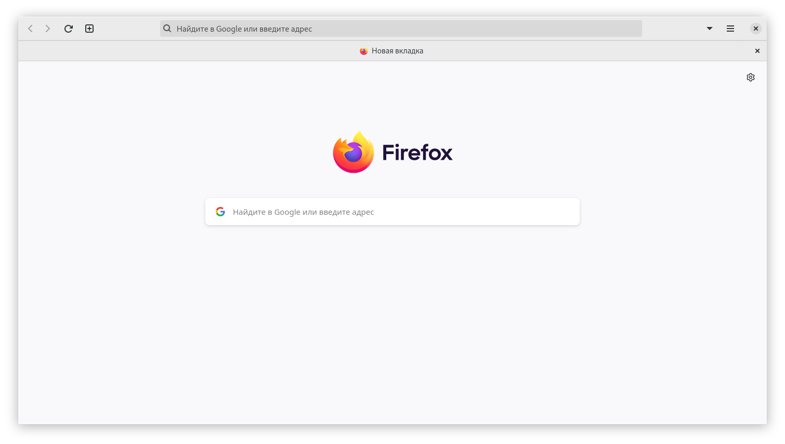
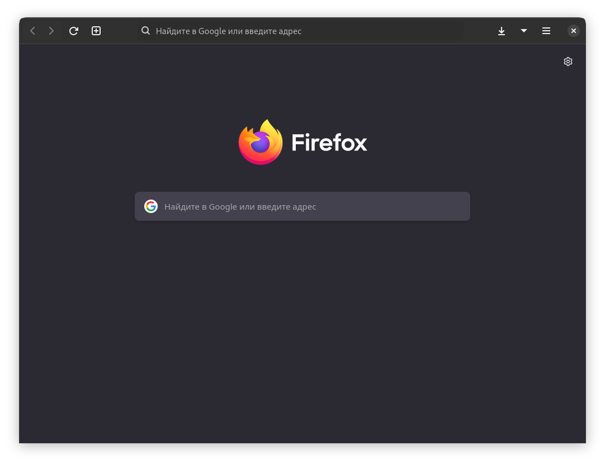

# firefox-adwaita-gnome-theme
This is a clone of <a href="https://github.com/rafaelmardojai/firefox-gnome-theme">this repository</a>, in which the css files have been changed to look like the adwaita theme (gtk 4).
    
    
The gradient on the top bar buttons has been removed. Removed background filling of buttons. Also added a frame around the close button. The colors have also been changed. This is not an exact copy of the adwait(libadw) theme introduced in gnome 42. But if you find something wrong, please let me know. Initially made for myself, but decided to put it in the public.
